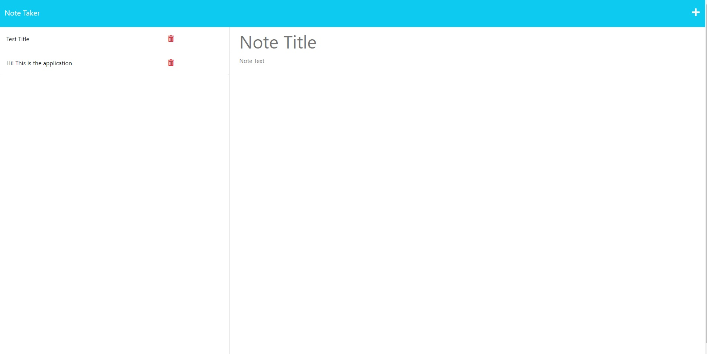

# note-taker

## Description

This webpage allows you to take notes and save them. Whenever you write a note and save it, it will save to the db.json file. All notes are pulled from and written to the db.json file. You can also click the trash can to delete the note.

## Installation

You can install the note-taker application on github here

https://github.com/Rockojoe2/note-taker

or visit the heroku page here

https://rocky-reaches-35764-30b1f38138e9.herokuapp.com/

## Credits
UTA class folder

Worked with classmates May Pham (https://github.com/mayphamx), Lucas Wysoczanski (https://github.com/LucasWyski001) Daniel Lee: (https://github.com/drog41813) and Mica Villanueva(https://github.com/micavilla) 

## License

MIT License

---

